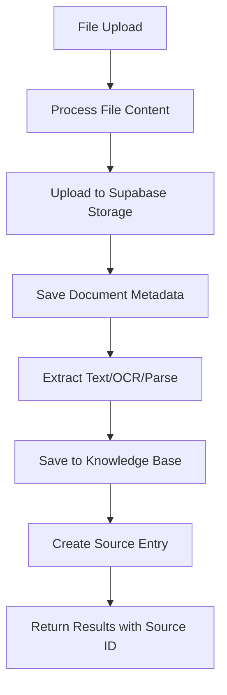
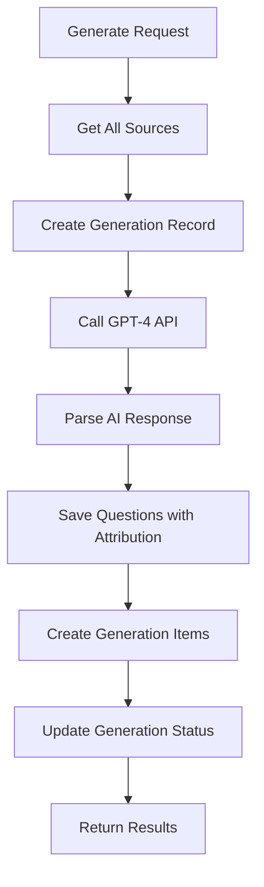

# 📚 History Tracking & Source Attribution System

## 🎯 **Overview**

The QuizMaster app now includes comprehensive **source tracking** and **generation history** capabilities. Every piece of content ingestion and AI generation is recorded with full attribution, providing users with a complete audit trail of their learning materials.

---

## 🗄️ **Database Schema Enhancement**

### **New Tables Added**

#### 📋 **`sources` Table**
Tracks all ingested content with detailed metadata:

```sql
CREATE TABLE sources (
  id UUID PRIMARY KEY,
  topic_id UUID REFERENCES topics(id),
  user_id UUID REFERENCES auth.users(id),
  document_id UUID REFERENCES documents(id),
  
  -- Source identification
  source_type TEXT NOT NULL, -- 'file', 'youtube', 'text'
  source_name TEXT NOT NULL, -- filename or YouTube URL
  original_name TEXT,        -- original filename
  
  -- Processing metadata
  file_type TEXT,           -- MIME type
  file_size INTEGER,        -- bytes
  word_count INTEGER,       -- extracted words
  processing_status TEXT,   -- 'processing', 'completed', 'failed'
  metadata JSONB,           -- source-specific data
  
  -- Timestamps
  ingested_at TIMESTAMP DEFAULT NOW(),
  processed_at TIMESTAMP,
  
  knowledge_base_id UUID REFERENCES knowledge_base(id)
);
```

#### 🤖 **`generations` Table**
Tracks all AI generation activities:

```sql
CREATE TABLE generations (
  id UUID PRIMARY KEY,
  topic_id UUID REFERENCES topics(id),
  user_id UUID REFERENCES auth.users(id),
  
  -- Generation metadata
  generation_type TEXT NOT NULL, -- 'bulk', 'single', 'regeneration'
  ai_model TEXT DEFAULT 'gpt-4',
  prompt_version TEXT DEFAULT 'v1',
  
  -- Results
  items_generated INTEGER DEFAULT 0,
  breakdown JSONB DEFAULT '{}', -- {flashcards: 5, multiple_choice: 3}
  source_ids UUID[],            -- sources used for generation
  
  -- Status tracking
  status TEXT DEFAULT 'processing',
  error_message TEXT,
  
  -- Timestamps
  started_at TIMESTAMP DEFAULT NOW(),
  completed_at TIMESTAMP,
  
  -- Performance metrics
  processing_time_ms INTEGER,
  tokens_used INTEGER
);
```

#### 📝 **`generation_items` Table**
Links individual questions to their generation batch:

```sql
CREATE TABLE generation_items (
  id UUID PRIMARY KEY,
  generation_id UUID REFERENCES generations(id),
  question_id UUID REFERENCES questions(id),
  
  -- Item metadata
  item_type TEXT NOT NULL,        -- 'flashcard', 'multiple-choice', etc.
  item_title TEXT,               -- extracted title/question
  difficulty TEXT,               -- 'easy', 'medium', 'hard'
  derived_from_sources UUID[],   -- specific source attribution
  
  created_at TIMESTAMP DEFAULT NOW()
);
```

#### 📊 **`topic_history` View**
Unified chronological view of all topic activity:

```sql
CREATE VIEW topic_history AS
SELECT 
  'source' as entry_type,
  s.id as entry_id,
  s.topic_id,
  s.source_name as title,
  s.source_type as type,
  s.ingested_at as timestamp,
  s.word_count,
  s.metadata
FROM sources s

UNION ALL

SELECT 
  'generation' as entry_type,
  g.id as entry_id,
  g.topic_id,
  CONCAT('AI Generation - ', g.items_generated, ' items') as title,
  g.generation_type as type,
  g.completed_at as timestamp,
  NULL as word_count,
  g.breakdown as metadata
FROM generations g
WHERE g.status = 'completed'

ORDER BY timestamp DESC;
```

---

## 🔄 **Enhanced Processing Pipeline**

### **File Upload Flow**


### **AI Generation Flow**


---

## 🎨 **History Tab UI Features**

### **Three View Modes**

#### 🕒 **Timeline View**
- **Chronological display** of all sources and generations
- **Visual timeline** with source type icons
- **Detailed metadata** for each entry
- **Processing status** and statistics

#### 📋 **Sources View**
- **Source overview** with statistics
- **Detailed source cards** with metadata
- **Generated items count** per source
- **File type and processing info**

#### 🤖 **AI Generations View**
- **Generation history** with expandable details
- **Performance metrics** (processing time, tokens)
- **Breakdown by item type** (flashcards, questions, etc.)
- **Individual item tracking** with source attribution

### **Visual Elements**
- 📄 **PDF documents** with page counts
- 💻 **Code files** with language detection
- 🖼️ **Images** with OCR processing badges
- 🎥 **YouTube videos** with transcript status
- 🧠 **AI generations** with item breakdowns

---

## 🔌 **API Integration**

### **Endpoint**: `GET /api/topics/:id/history`

#### **Response Structure**
```json
{
  "success": true,
  "data": {
    "topicId": "123e4567-e89b-12d3-a456-426614174000",
    "timestamp": "2024-01-15T10:30:00Z",
    "summary": {
      "totalSources": 5,
      "totalGenerations": 3,
      "totalWords": 15847,
      "totalGeneratedItems": 42
    },
    "timeline": [
      {
        "id": "source-uuid",
        "type": "source",
        "title": "Machine Learning Fundamentals.pdf",
        "category": "file",
        "timestamp": "2024-01-15T09:00:00Z",
        "wordCount": 5000,
        "sourceType": "file",
        "metadata": {
          "fileType": "application/pdf",
          "pages": 25,
          "isCodeFile": false
        }
      },
      {
        "id": "generation-uuid",
        "type": "generation", 
        "title": "AI Generation - 15 items",
        "category": "bulk",
        "timestamp": "2024-01-15T09:30:00Z",
        "itemsGenerated": 15,
        "sourceIds": ["source-uuid-1", "source-uuid-2"]
      }
    ],
    "sources": [...],
    "generations": [...]
  }
}
```

#### **Usage Examples**

**JavaScript/Fetch:**
```javascript
const history = await fetchTopicHistory('topic-id', {
  baseUrl: 'https://yourapp.com',
  headers: { 'Authorization': 'Bearer token' }
});
```

**cURL:**
```bash
curl -H "Authorization: Bearer token" \
  https://yourapp.com/api/topics/topic-id/history
```

---

## 📊 **Source Attribution Features**

### **Individual Item Tracking**
Every generated study item includes:
- **Source IDs** it was derived from
- **Generation batch** it belongs to
- **Creation timestamp**
- **Item-specific metadata**

### **Cross-Reference Capabilities**
- See which **sources contributed** to specific questions
- Track **generation efficiency** per source
- Identify **most productive sources**
- Analyze **content utilization patterns**

### **Audit Trail**
Complete history includes:
- **When** content was ingested
- **How** it was processed (OCR, transcript, etc.)
- **What** was generated from it
- **Which** AI model was used
- **How long** processing took

---

## 🔧 **Technical Implementation**

### **Service Methods Added**
```javascript
// Source tracking
await dataService.getSources(topicId)
await dataService.getSourcesWithStats(topicId)

// Generation tracking  
await dataService.getGenerationHistory(topicId)
await dataService.getTopicHistory(topicId)

// Internal methods
await supabaseService.createSource({...})
await supabaseService.createGeneration({...})
await supabaseService.addQuestionsWithGeneration(...)
```

### **Enhanced Processing**
- **File uploads** automatically create source entries
- **YouTube processing** tracks transcript availability
- **AI generation** records source attribution
- **Question creation** links to generation batches

---

## 🎯 **Benefits for Users**

### **📈 Learning Analytics**
- **Track content sources** that generate the most value
- **Identify knowledge gaps** by source coverage
- **Monitor AI generation** efficiency and quality
- **Review learning material** provenance

### **🔍 Content Management**
- **Find original sources** for any study item
- **Understand content lineage** and dependencies
- **Manage source diversity** across topics
- **Optimize content ingestion** strategies

### **📋 Study Organization**
- **Chronological view** of learning material development
- **Source-based filtering** of study items
- **Generation-based grouping** for review
- **Historical context** for all materials

---

## 🚀 **Future Enhancements**

### **Planned Features**
- **Source quality scoring** based on generation success
- **Automated source recommendations** 
- **Content gap analysis** and suggestions
- **Export capabilities** for history data
- **Advanced filtering** and search in history
- **Source collaboration** and sharing

### **Analytics Dashboard**
- **Visual timeline** with interactive elements
- **Source performance metrics**
- **Generation efficiency charts**
- **Content utilization heatmaps**

---

## ✅ **Ready to Use**

The history tracking system is now fully integrated and provides:

- ✅ **Complete source attribution** for all content
- ✅ **Comprehensive generation tracking** with AI metadata
- ✅ **Beautiful UI** with timeline, sources, and generations views
- ✅ **API endpoint** for external integrations
- ✅ **Real-time updates** as content is processed
- ✅ **Supabase integration** with RLS security

**Every file upload, YouTube transcript, and AI generation is now tracked with full provenance!** 🎉 